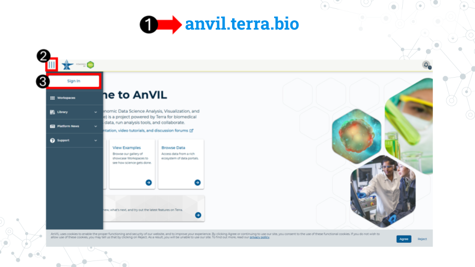
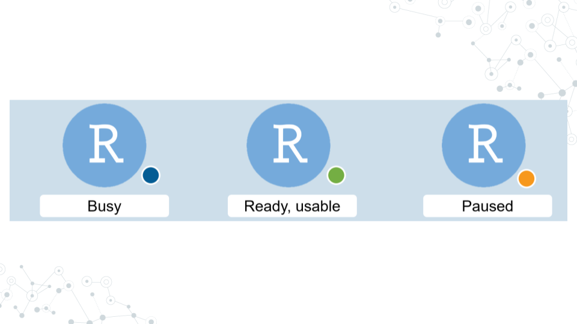
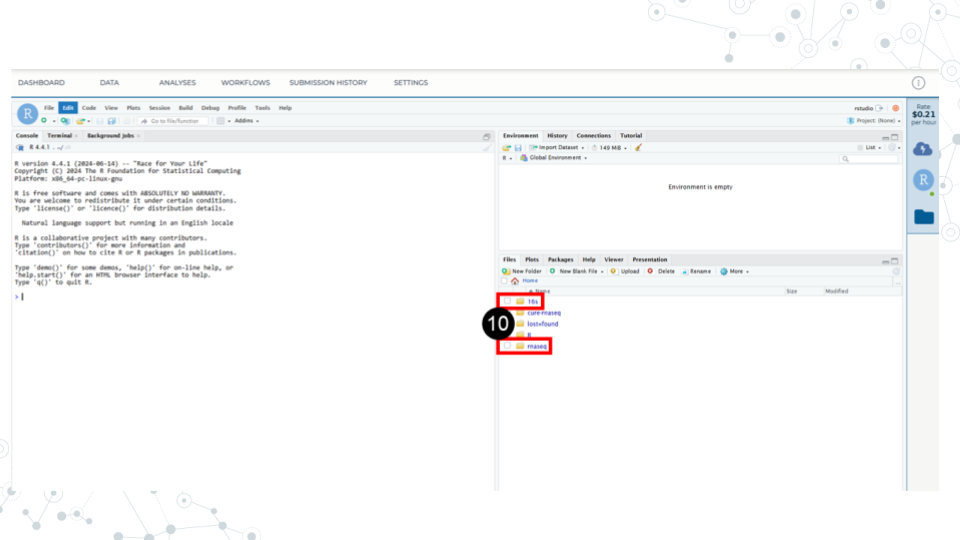
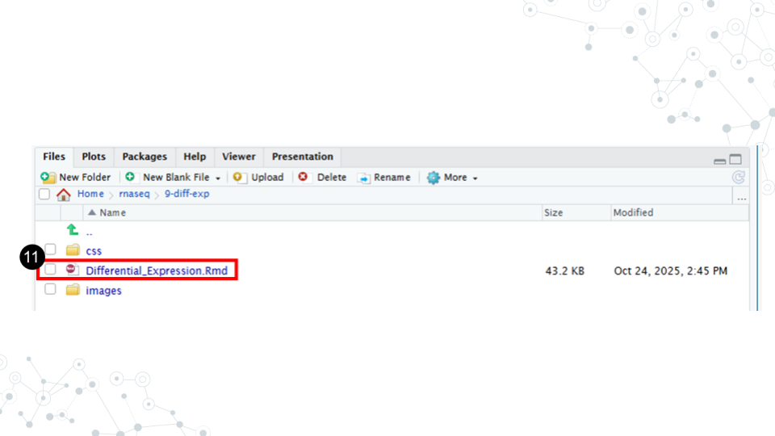
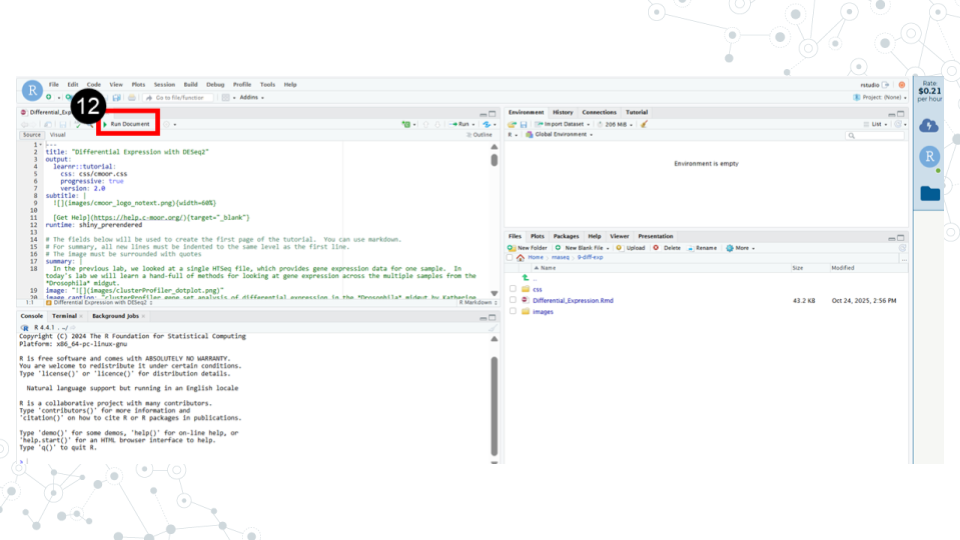

# (PART\*) Setting up on a cloud platform {-}

<!-- AnVIL --> 

# AnVIL

<!-- Set up code of OTTR Book-->

## About AnVIL

AnVIL (The Genomic Data Science **An**alysis, **V**isualization, and **I**nformatics **L**ab-space) is a platform created by the National Human Genome Research Institute (NHGRI) in collaboration with cloud computing platform providers like Google and Microsoft. Using AnVIL we you can access computing resources on the cloud through your browser without need for any fancy physical equipment. Through AnVIL you will also have access to all the software and data necessary to complete your research project. 

In this section, we will set up our accounts on AnVIL and go through the entire lifecycle of an RStudio environment from creation to deletion. You will repeat this process throughout the semester; feel free to refer back to this section if you need a refresher on how to use AnVIL.

## Sign up for an AnVIL account

#### Purpose

You will need an account on AnVIL in order to use the platform. In this section we'll go over the specifics of account creation.  

#### Learning Objectives

1. Create an account on AnVIL
1. Login to AnVIL
1. Share the email you used to sign up for AnVIL with your instructor (if applicable)

### Create an AnVIL account

Follow the written steps below or refer to the [slides](https://docs.google.com/presentation/d/1uwlG7uaTOnItdpd4Ll6nNQiBJKBivsvR-erupicAwJM/edit?usp=sharing) or video guide.

1. Open [anvil.terra.bio](https://anvil.terra.bio/) in <mark> **Google Chrome** </mark>. Google Chrome is the only officially supported web browser for AnIVL. Because of this, while you can run AnVIL in other browsers you strongly suggest using Chrome.
    a. It is a good idea to bookmark this page so that you can easily access it throughout the course.
1. Click the hamburger icon (3 lines) in the top left corner of the screen 
1. Click "Sign in"

4. Click "Sign in with Google".
5. Sign in with a <mark>**Google associated email address**</mark> such as an institutional email that uses Gmail or a personal Gmail account. You must use a Google associated email address to gain access to Google Cloud computing resources. 
6. If you are a student, share the email you used to sign up for AnVIL with your instructor following their instructions.

<mark>**Instructors should collect the student emails and use them in the next section, "Setting up workspaces on AnVIL." Students do not need to set up a workspace, and should proceed to the section, "Running a module on AnVIL".**</mark> 

## Setting up workspaces on AnVIL

<mark>**This section is only for instructors. Students do NOT have to set up workspaces.**</mark>

Follow the written steps below or refer to the [slides](https://docs.google.com/presentation/d/1uCiZDAwgh1iM5XPlpbK5uz7oVBujmimUXVQaR8iGuho/edit?usp=sharing) or video guide.

#### Purpose

We will learn about managing students using groups and how to clone a copy of the C-MOOR workspaces for each section of a given class.

#### Learning Objectives

1. Learn how to create groups that can be used to control users' access 
1. Clone the workspace of your chosen C-MOOR curriculum for each section of your class
1. Simultaneously add students of that section to the chosen workspace

### A note to instructors on billing

Instructors should have a Google billing account associated with their AnVIL account on Terra. We will not cover how to set up a Google Billing Account, which is separate from and required by a billing project. For assistance with setting up your billing account we suggest refering to the Terra (the platform on which AnVIL runs) [guide to billing](https://support.terra.bio/hc/en-us/articles/360048632271-Terra-costs-and-billing-GCP-details) and speaking with your institution’s information technology and finance departments. 

Our team at C-MOOR is still piloting our curriculum on AnVIL. As such, we don't have much information on the approximate cost per student. We hope to provide this data in the future. 

The best way to conserve costs is to <mark>make sure that students close out their session on AnVIL properly, including the deletion of the persistent disk</mark> after they are done working. AnVIL will continue to bill the billing project even if the environment is not in active use. 

For more information on how to control computing charges, please see the Terra guide: [How to cut off GCP charges](https://support.terra.bio/hc/en-us/articles/360042023952-Runaway-costs-How-to-cut-off-GCP-charges). 

### Using groups to manage classes

We recommend you manage students and their access to workspaces through groups. When people are added to a group, they are given a new group email address that controls everyone within that group. For example, if there are 20 people in the group, all 20 are added at one time when the group email is used to give a group access to a workspace. Likewise, we recommend any management of students, such as removal or additions later in the class, be managed through the group interface.

1. Access billing by clicking on the hamburger icon in the top left corner of the window, click on your name, and select groups. This will take you to this groups page.
1. Click Create New group. You will be prompted to give your group a unique name.
1. Click on the name of the newly created group to enter it.
1. Click add users. Add users to the group using the same email they used to sign up for AnVIL.
1. You can use the group email created for the group seen on the group management page to manage everyone in that group. For example, you can add everyone in the group to a workspace by adding this group email to the billing project.

### Clone a workspace on AnVIL

The instructor will clone the workspace in AnVIL. We recommend cloning one workspace for each section you teach. Each workspace can be shared by approximately 50 students without issue. You can clone multiple workspaces for exceptionally large classes. Students in a given section will use the cloned workspace for all learning modules and the research project.

1. While logged into AnVIL, using the hamburger icon in the top left corner of the screen, navigate to the workspaces page
2. Select the public tab
3. Search for the desired workspace. Your instructor will tell you which workspace to look for (miniCURE-RNA-seq or miniCURE-16S-microbiome).
4. Click on the more options icon on the right side of the desired workspace and click clone

5. Give the cloned workspace a unique name. We recommend choosing the class and section name that the workspace is intended for.
6. Confirm the billing project is the one you want to use. In this example, we have a billing project by semester and curriculum. All computational costs by students in the workspace will be billed ot this account.

7. In the sharing step, add the students to the workspace using their group email. Refer to the section on managing students with groups for more information on adding students to groups.
8. Make the students writers.
9. Confirm that the can compute box is checked. This allows the students to computational resources on the cloud. Without it, they won’t be able to open any modules or run any code.
10. The other options can be left as defaults. Finish cloning the workspace.

**Students should now have access to the workspace. To view your workspaces, click on the hamburger icon in the top left of the screen and go to the Workspaces tab. We recommend that any further management of people and their access to the workspaces be done by managing their group.**

## Running a module on AnVIL
<!-- change fig.align quotes from single to double -->

#### Purpose

In this section we will go over how to run C-MOOR modules on AnVIL. We will go over how to create an RStudio environment in that workspace to run the module and properly end a session on AnVIL to prevent runaway costs.

#### Learning Objectives

1. Launch a module through the cloned workspace
1. Close out a session on AnVIL properly to prevent runaway costs

### What is a workspace?

The workspace is the heart of AnVIL. Here are some key points about workspaces:

- Every workspace comes with its own Google Bucket (our cloud storage). Your bucket will be empty.
- Every workspace has its own billing project. Students who are not yet associated with a billing project will not be able to compute on their workspace.
- We can control access levels of users and set them either as owners, writers, or readers. Students will be writers with compute access.

### Running modules on AnVIL

#### Starting a module on AnVIL

When you open the workspace, you will be on the dashboard tab by default. The dashboard contains the instructions on how to use the workspace, links to C-MOOR websites, and the startup script. Let’s try running a module.

1. Take note of the container image for the custom environment. We recommend copying this to a word document or notepad. Make sure there are no spaces before or after what you copy. You will need to input this URL soon.

2. Take note of the startup script. Make sure there are no spaces before or after what you copy. This script is held in the original workspace everyone cloned. It does not have to be in your own workspace for it to work. You will need to input this URL soon.

3. Click on the Environment Configuration button , the cloud with a thunderbolt.

4. In the RStudio section, click Settings.

5. <mark>Make sure you have the following settings matching these instructions. Under Application configuration, choose “Custom environment”. In the container image field that appears, paste the container image URL that we copied earlier from the workspace. The URL should end with Bioconductor 3.19.1. In the startup script field, paste the URL for the startup script. This URL contains the words C-MOOR Startup Script. Set the creation timeout limit to 15 minutes. </mark>

6. Select 4 CPUs and 15 gigabytes of memory. 

7. Confirm that the cloud compute cost is 20 cents per hour. If it is not 20 cents per hour, reselect CPUs and memory allocation in part 6. This is a known bug in AnVIL at the writing of this guide.

8. Scroll to the bottom of the window and click “Create”. 

It will take some time for the RStudio Environment to be created. You can keep track of the status of the environment based on the colored dot next to the RStudio icon. The dot will turn green when the environment is ready. While it is loading (blue), you cannot interact with it.

9. When the environment is ready, use the Open RStudio button that will pop up. You can also access RStudio through the Analyses tab. If you hold down Ctrl as you click, you can open RStudio in a new window.

10. Use the file explorer in RStudio to navigate to your module of choice. From the folder called cure-rnaseq, go to tutorials, and then the folder of the module you want.

11. In the module’s directory, open the .Rmd file by double clicking its name.

12. Click Run Document in the open .Rmd file

<mark>**When you are finished, make sure you close out your session properly to prevent runaway costs!**</mark>. 

### Closing out a session on AnVIL

1. On the right side of the screen, click the Cloud Environment button. This is the Cloud with the lighting symbol.
1. Under the RStudio section, click settings.
1. Scroll to the bottom of the new window and click delete environment.
1. Check <mark>**Delete everything, including the persistent disk or your instructor's billing account will incur costs for storage**</mark>. 
