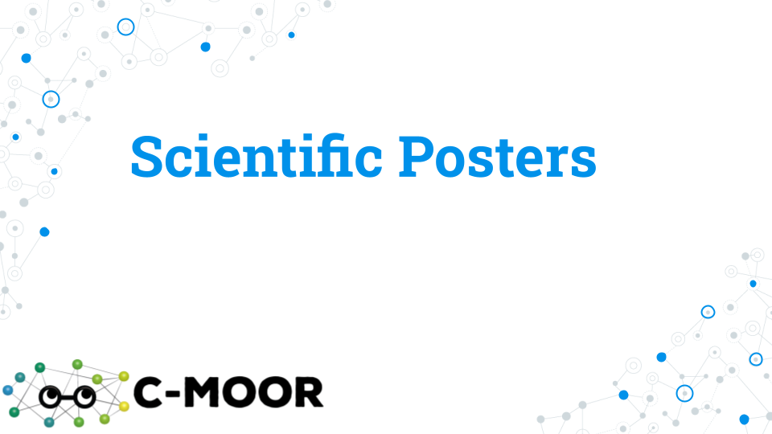
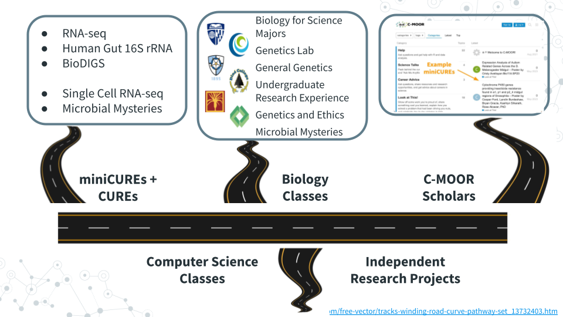
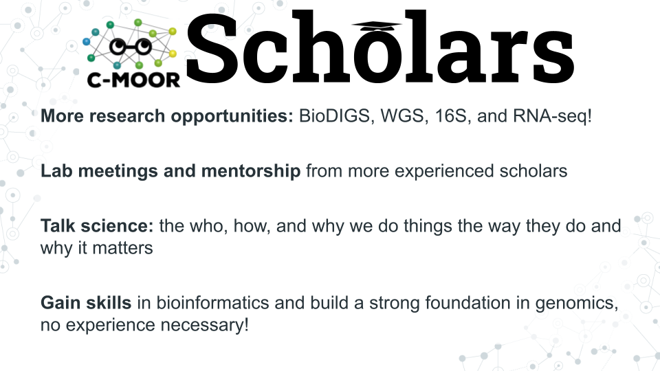
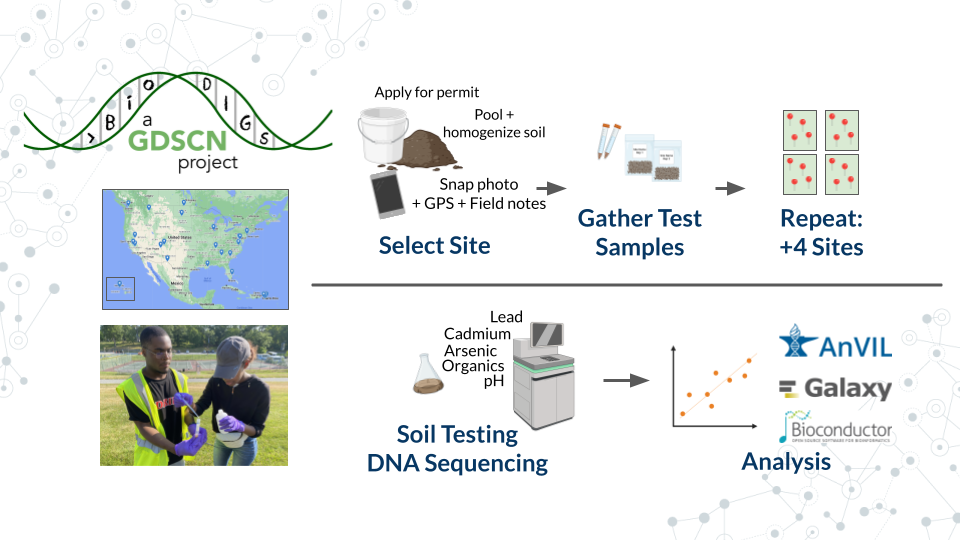

# (PART\*) COMMUNITY ANALYSIS AND FEEDBACK {-}


# Scientific Posters

In this section we will go over how to create a scientific poster. We chose a poster as our final deliverable in C-MOOR because they:


- **Facilitate participation in research symposiums**: Students can use their poster to apply to present at research symposiums or conferences with minimal additional effort beyond what they do in class. If your institution does not have a research day, consider starting one using these posters as a foundation as we did at Clovis Community College! Your school's library is another great point of contact in getting a poster session or research day set up. Some of the events students have participated in using their C-MOOR projects include:

  - The Clovis Community College Research Day
  - The Notre Dame of Maryland University Research Day
  - The GRADS-4C Conference (2025)


- **Serve as a physical representation of student achievement**: If printed, once finished with the class, students can choose to take their poster with them or leave it with the class to be hung up around the classroom or the hallways. This gives their research project more visibility, serves as an advertisement for other students who might be interested in taking the class, and showcases what students have accomplished. 


- **Can easily be shared digitally**: A presentation can't be repeated twice without a recording, and each recording can take up a lot of digital storage. A poster on the other hand, is a great compressed product that can be posted on a student's (or the institution's) social media and help get their work seen by others. Posters are even small enough that they can be attached to an email and sent to prospective supervisors and collaborators interested in a quick summary of their work. See our [Look at This!](https://help.c-moor.org/c/look-at-this/) category on the C-MOOR Academy Discussion Forum to see all the posters students have created and shared so far!

- **Posters can be used to measure student achievement and understanding**: We have previously used these posters to evaluate student learning, even years after students have left the classroom. Check out our [poster on posters!](https://drive.google.com/file/d/1kK6FBBLbHiAAsTUgxwzHRlK1qCo__eCy/view?usp=sharing)

## Making a Group Poster 

### Preparing to make a poster

An important part of scientific research is presenting your findings. 
Poster is a powerful visual way to communicate new and exciting findings, share ideas and get feedback. 
No wonder Poster sessions are an integral part of any conference or symposium. 
Throughout research project work, students will work with their groups to put together a scientific research poster.
 

### Part 1 - Choose a Template
*Estimated time: 5 minutes*

1. With your group, open a suggested [poster template](https://docs.google.com/presentation/d/1chz02nzYklAEjOtHrPsJZccGy1sFUZvqdlfcUyfj3I4/edit?usp=sharing) to use for your poster. 
1. Discuss with your group how you will divide up the work and exchange important information (e.g. phone numbers, email). Consider the following sections: 

- Abstract/Introduction
- Methods
- Results
- Conclusions/Discussion
- References 
- Acknowledgments

Notice these posters are sized at 36 x 42 inches, but there are many other commonly used sizes. 
Refer to your instructor on what poster size to use; not every poster will fit every stand when printed (if applicable). 
Notice that the posters in this slidedeck come in two-column, three-column, and mixed formats.
Think about your figures and tables and select a format that makes the most sense for them. 
There are also some example posters in the last two slides that we will use to examine the anatomy of a research poster further in the next part.


### Part 2 - Make an Academic Research Poster

*Estimated time: ---*

Complete the following components of your research poster with your group. You might not do them in this order, but these are the components you are being graded on. For more details on each of these sections and their role in a scientific paper, see the Scientific Literature Lab.

#### The header: title, authors, and affiliations


Since you completed this work as a team of scientists, all of your team members are considered authors. List your team members in alphabetical order. The author’s affiliation is the university, college, research institution or company that the work was conducted at.  

- An example affiliation for Clovis Community College would be: “Department of Biology, Clovis Community College, California, United States.” 
- If multiple institutions exist, you will need to use superscript to denote who has what affiliation (see the example poster).

Include the C-MOOR logo, the logo of your institution(s), and the most immediately relevant funding source (if applicable) in the header.

<!-- NOTE: &nbsp; creates a space in Markdown. In this instance, adding extra spaces after the checkbox didn't seem to work. -->

**Check the header of your poster:**

```
- All authors are listed
- All authors’ home institutions are referenced
- The title of the poster is short and focused on your specific project topic
- Appropriate logos are included: E.g. the C-MOOR logo, the logo of your institution
- Relevant funding source (if applicable) is listed
```

A note on the title:

- The title of the poster describes the main result of your research
- The title of the poster does not overstate the findings or significance of your research


#### Abstract

C-MOOR Abstract examples:


An abstract is a concise summary of your work. An effective abstract will be well designed and communicated, and will inform the reader of the relevant background to the research, scientific hypothesis being tested, the purpose of the study, the main methods, and the most important results and conclusions.  

Abstract can be difficult to write because it combines all research pieces and requires effective and consice communication of those sections.
Many scientists choose to write the abstract last, after they fully understand the conclusions and implications of their work. 

**Your abstract should do the following:**


1. **Clearly and briefly** state purpose, hypothesis, aims, and/or objectives of the research.

```
- e.g. Our hypothesis is that the healthy gut microbiome has more microbial diversity than the gut of an individual with a celiac disease.`
- e.g. We hypothesize that maternal antibiotic treatment correlates with higher antibicrobial resistance in infant microbiome.`
```

2. **Clearly and briefly** summarize relevant background information such as: 

```
- A problem or question at hand 
- Model organism
- The gene of interest and its function 
- The relevant phenotypes (e.g. disease-state) 
- The known connection between genotype and phenotype
- Relevant biological processes
```

3. **Clearly and briefly** summarize the main results of your study, and how they may relate to the hypothesis.

```
- e.g. We found that gene X was differentially abundant between the eye and all other tissues, suggesting gene X plays an important role in the eye. This may be important for learning more about eye development and X condition.` 
- e.g. We found an association between age and the presence of Y bacteria, which supports our hypothesis that Y bacteria is involved in the disease state`
```

4. **Clearly and briefly** summarize methodology you used in your research.

```
- e.g. Using Galaxy we analyzed the genomic diversity of the gut microbiome and compared fecal samples between individuals with Celiac Disease (CD) and a control group on a healthy diet without CD.`
- e.g. We analyzed a publically available dataset comparing RNA-seq gene expression between the left and right eye in DESeq2.`
```

***Overall, the Abstract is heavy on summary aspect of things, and lean on details aspect of things***.

#### Introduction


An introduction typically appears immediately after the Abstract section, and while abstract is very brief and consise, Introduction provides more context and background information to your research. 
Indeed, the main goal of the Introduction is to **clearly elaborate on relevant background information and provide context for research gap and hypothesis**.

***Overall, the Introduction is longer than the Abstract, heavier on providing research context and background, and leaner on result summary and conclusions.***.

- Sometimes, you will se an Introduction section used instead of the Abstract + Introduction sections, in which case, the Introduction will contain both, abstract information plus additional background information, such as this published PacBio's  abstract on 'Genome-resolved metagenome assembly of human oral microbiome using highly accurate long-read sequencing'. 


#### Materials and Methods


The materials and methods section will detail your analysis of the data. Don’t provide any of your results, just the methods. If you did not generate the data yourself from raw samples, you will simply cite the paper that made them instead of detailing their construction. We will also need to list any programs we used and provide credit to their creators.

Some other things you might include would be what type of analysis you decided to do (which parts of the body parts you analyzed, sets of genes, what p-value you used, etc.).

#### Results


The Results section is where you will detail your data primarily through **figures and tables**, though sometimes written text is included. Begin by creating your tables and figures. 

**Figure body**:

- Has high resolution images, well spaced and labeled parts and text. 
- Place the figures and tables in order of how you want to present them and name them such as **Figure 1, Figure 2, Table 1, Table 2, etc**.

**Figure Legend**:

- Figures have their legends *underneath* them. Tables may have their legends also *above* them.
- The legend should be in a smaller font than the main text on the poster.
- A legend should includes a **figure title**, which is a declarative statement that summarizes  findings.
- A legend also includes **figure text** which a) identifies (and can  briefly describe  parts), b) includes brief description of of methods necessary to understand figure and c) should include relevant statistics (stats).

**Optional components**

- Figures and Tables can have additional (optional) text. E.g.an optional text can describe the findings of the figure upfront to engage.
- A **Section Title/Header** which summarizes section or figure in a manner that is broader than figure legend title - an attention grabber.
- Bullet pointed text that summarizes the main findings of the figures/tables.

#### Conclusions/Discussion


The discussion section of the paper is your chance to analyze and interpret your results. The discussion section generally addresses the following:

- What do your results mean?
- How do they fit into the bigger picture?
- If any experiments did not give expected results, hypothesize why that might have been the case and propose alternate experiments that could confirm or clarify your results.
- Include at least one sentence of future work that you would do if you had more time or what students in upcoming semesters could do to continue to answer your questions.

#### References


All the references that you cite on your poster must be present in a References section including the following sections: Introduction, Methods, and Discussion. To save space on our posters, we will number our references (ex. 1-5) and use the numbers as citations throughout the text of your poster. You may have a lot of references; it is okay to put them in tiny text if you have to in order to make them fit.

There are many different ways to format the reference section. We will make ours in alphabetical order by the first author’s last name. All of your sources must be scientific journals and should use the following format:

> Authors (year) “Title.” Journal Name, vol. #, page #s, DOI

Online article that is also in print:

> Haussecker D., Huang Y., Lau A., Parameswaran P., Fire A. Z. and M. A. Kay (2010) “Human tRNA-derived small RNAs in the global regulation of RNA silencing.” RNA, Vol. 16, page 637-695,  doi:10.1261/rna.2000810

Online article only:

> Marianes, A. and A. C. Spradling (2013) “Physiological and stem cell compartmentalization within the Drosophila midgut.” eLife, doi:10.7554/eLife.00886


#### Acknowledgements


The acknowledgements section is where you give thanks to the people, organizations, and institutions that have supported you in your research. If relevant, include the grant ID # of your funding source. Institutions and organizations that have contributed to your research - but you do not belong to - can be thanked here.

### Part 3 - Proofread and Add Final Touches

*Estimated time: 30 min to an hour*

1. Each group member should re-read the poster from beginning to end and fix any typos or grammatical errors.
1. Check the alignment of figures, text boxes, titles, etc.
1. Add some finishing touches. You can play with the color, the font, add additional images if it’s relevant.

### Part 4 - Canvas Discussion

*Estimated time: 30 min*

You will turn in your poster to be graded as a group in a Canvas Assignment and post it to a Canvas Discussion to be viewed by the class.

1. Convert your poster to a pdf.
1. Have one member of your group turn in the pdf of your poster to the Graded Canvas Assignment. This assignment is already set up so that if one group member turns it in, it will show as submitted for all students in the group. This is where your instructor will grade you poster as a group.
1. Have one member of your group post a pdf of your poster in the Canvas C-MOOR Poster Discussion.
    a. With your poster, introduce your  group members and copy and paste your abstract into the post.
    a. Insert your pdf into the post and edit the link so that it automatically shows the inline preview. This will make it easier for students to view your poster.
1. As an individual, read through the other posters from different groups.
1. Post comments

#### Grading Criteria

Your instructor will provide for you a rubric specific to your class. 
Refer to the rubric as your build your poster to make sure you have all the neccessary components.

#### Footnotes

**Resources**

- [Google Doc]
- [Generic rubric](https://docs.google.com/document/d/13eB1fwHEB1I00JHBUQLZIJsi-iQZYaWaXThPqCTU17g/edit?usp=sharing)

**References**

- [Abstract vs. Introduction](https://fourwaves.com/blog/abstract-vs-introduction/)
- [Preparing and presenting effective research posters] (https://onlinelibrary.wiley.com/doi/10.1111/j.1475-6773.2006.00588.x)

**Contributions and Affiliations**

- Stephanie R. Coffman, Clovis Community College
- Valeriya Gaysinskaya, Johns Hopkins University
- Frederick Tan, Johns Hopkins University
- Sayumi York, Notre Dame of Maryland University

Last Revised: August 2025


<!-- Set up code -->


## Lecture - Scientific Posters

*Estimated time: ---*

<!-- change fig.align quotes from single to double: DID NOT WORK-->

<!-- change fig.align quotes from single to double and remove fig alt-->



[Scientific Posters](https://docs.google.com/presentation/d/1coAc4GY1CkpiBcamCYsEemjOsa6zTWiK6kd2C1iAaKA/edit?usp=sharing)

## Activity - Scientific Posters

### Activity

*Estimated time: ---*

#### Instructions

1. Review **[Presentations Guidelines for Posters](https://ur.umbc.edu/urcad/resources/posters-guidelines)**

2. Skim three posters from among the following (must be Biology if from UMBC Posters)

- **[Look at This! Category on the Academy Discussion Forum](https://help.c-moor.org/c/look-at-this/8)**

- **[UMBC Biology Posters](https://ur.umbc.edu/poster-presentation-examples)**

- **[The example PacBio Poster](https://www.pacb.com/wp-content/uploads/PAG-Portik.pdf)**

3. Pick one poster and address the following points.

- **Notice** – What about this poster most interests you?

- **Wonder** – Two or three questions you would ask the authors.

- **Support** – Two or three suggestions on how the poster could be improved.

### Grading Criteria

Comment on your class' LMS (Blackboard, Canvas, Google Classroom) discussion board or refer to your instructor's choice.

### Footnotes

**Contributions and Affiliations**

- Valeriya Gaysinskaya, Johns Hopkins University
- Frederick Tan, Johns Hopkins University
- Sayumi York, Notre Dame of Maryland University

Last Revised: January 2026


## Activity - Share Your Poster

### Introduction

It's almost time!  Prepare for your final presentation by thinking about how to describe the great work that you've done this semester in both written and oral form.  Assume that your audience has a basic scientific background but does not know a lot about your particular field.  Provide enough context to give your listener a reason to care about your project and each of the results you will describe.  You have five minutes to get your story across so have a plan and practice.

#### Activity 1 – Share Your Poster

*Estimated time: 20 min*

#### Instructions

1. Convert and/or download your poster as a .png file in full resolution. Make sure you look at the .png file and confirm the poster is high enough quality that even small text can be read. 

- In Google Slides:

    a. Go to File > Download > select PNG image or JPEG image.

    b. Locate the downloaded file on your computer. By default, most computers will download files to the “Download” folder or the Desktop.

- In PowerPoint:

    a. Enter the File tab to the top of the window, to the left of the Home tab

    b. Select Save As

    c. Select This PC

    d. In the field underneath the file name, select the *.png or *.jpg format

    e. Select save

    f. Locate the saved file on your computer. By default, most computers will save the file in the same location as the original PowerPoint (.pptx) file.


2. Have one person on behalf of the group create a New Topic on your instructor's chosen forum below with the title of your poster as the topic title and your .png file as the contents in either the:

    a. [C-MOOR Academy Discussion Forum's Look at This!](https://help.c-moor.org/c/look-at-this/8) category if every member of your group agrees to share your work publicly.

    b. Class category on the C-MOOR Academy Discussion Forum (if applicable) to keep your work private 

    c. The forum or outlet of your instructor's choice

3. Have each person in the group reply to your topic using your own words answering your choice of 2 of the following 5 questions, with the question included as part of the post. Your answers should be specific and refer directly to your research poster:

    - What was your favorite part about doing the research project and why?
    - What was something about your project or the research process that surprised you and why?
    - What is one specific skill in biology and/or research that you learned through this project? Give an example how you used this in your project.
    - What is an example of a challenge that you had to overcome during this research project?
    - What is one thing you learned from this project that you can take forward in your future work? How do you see it being helpful in your chosen field?


#### Questions

| 1. A copy of your written answers here: |
|:--|
||
<br>

| 2. Provide the URL of your Discussion Forum post (if applicable) |
|:--|
||
<br>

### Activity 2 – Present Your Poster

*Estimated time: 40 min*

#### Instructions

1. Create a plan for a 5 min presentation taking into consideration:

    a. Who will speak when

    b. What each person will cover

2. Practice your presentation

    a. In your group

    b. To the class


#### Questions

| Create a bullet point outline of who will speak what when: |
|:--|
|Overview (question, background, hypothesis)|
|Approach (dataset, general methods) |
| Results (detailed methods, notable results)|
|Conclusions (summary, next steps)|
<br>

### Grading Criteria

- Submit your work on your LMS (Blackboard, Canvas, Google Classroom) or refer to your instructor's choice.

### Footnotes

**Resources**

- [Google Doc](https://docs.google.com/document/d/1OvMwNIsB019EVZukYG-8JXg7P4no4WmEc2w4ryvKz4k/edit?usp=sharing)


**Contributions and Affiliations**

- Valeriya Gaysinskaya, Johns Hopkins University
- Frederick Tan, Johns Hopkins University
- Sayumi York, Notre Dame of Maryland University

Last Revised: January 2026


# Professional Development

Now that you've finished your C-MOOR project, how do you close out your research experience or take it further? In this section we'll explore how to publicize and use your experience to help build your professional career.



## Lecture - Next Steps

*Estimated time: ---*


[Slides: Next Steps](https://docs.google.com/presentation/d/1cH7vm_lAxe_JUlr1H_M5Ujas-pTUY8qPBthTcSOiIXA/edit?usp=sharing)


## Activity - Next Steps

### Introduction

Congratulations on completing your research project! Take a moment and reflect on all that you've accomplished during this semester, especially those of you for whom this was your first research experience! Did you experience all the ups and downs of the research project from coming up with a research idea hypothesis, dealing with unexpected set-backs, and discovering something new? 

We’ll wrap up here with several next steps including completing feedback to improve the next offering of this course, researching opportunities to do more science, exploring communities where scientists openly share insights, and optionally sharing more work.

### Activity 1 – Complete Feedback

*Estimated time: 15 min*

#### Instructions

Help us improve this course! 
If you're willing to have your feedback used in an official educational research survey, you will need to use a pre-authorized survey link from C-MOOR. Either way, your instructor will connect you to any feedback form.


### Activity 2 – Research Opportunities

|1. Knowing what you know now about research, what related skills are you interested in developing further and why?|
|:---|
| Your text here:|
<br>

|2. REU – Which NSF Research Experiences for Undergraduates program would you attend and why?|
|:---|
| a. Overview – [https://www.nsf.gov/funding/initiatives/reu/students](https://www.nsf.gov/funding/initiatives/reu/students)|
| b. Search – [https://www.nsf.gov/funding/initiatives/reu/search](https://www.nsf.gov/funding/initiatives/reu/search) 
- Consider filtering by Research Area (e.g. Biology)|
| Your text here: |
<br>

### Activity 3 – Explore Communities

*Estimated time: 15 min*

#### Instructions

Spend a little bit of time browsing communities that discuss genomics, data analysis, and more. Paste the URLs for a couple of posts that you find interesting with a brief comment.

#### Questions

1. Specialized Communities

a. SEQanswers: the next-generation sequencing community 

- [https://www.seqanswers.com](https://www.seqanswers.com)

b. Biostars: bioinformatics explained 

- [https://www.biostars.org](https://www.biostars.org)

|Post URL of interest for Specialized Communities and your comments here:|
|:---|
| |
<br>

2. General Communities

a. Reddit: The heart of the internet

- [https://www.reddit.com/r/metagenomics](https://www.reddit.com/r/metagenomics)

b. Twitter/X: It’s what’s happening

- [https://x.com/search?q=%23metagenomics](https://x.com/search?q=%23metagenomics)

c. Bluesky: Social media as it should be

- [https://bsky.app/search?q=metagenomics](https://bsky.app/search?q=metagenomics)

|Post URL of interest for General Communities and your comments here:|
|:---|
| |
<br>

### Grading Criteria

- Download as Microsoft Word (.docx) and upload to your LMS (Blackboard, Canvas, Google Classroom) or refer to your instructor's choice.

### Footnotes

**Resources**

- [Google Doc](https://docs.google.com/document/d/11gEndv8IaqVKuq53rMzltsUQSvyLNjczRTZAD_xt_do/edit?usp=sharing)

**Contributions and Affiliations**

- Valeriya Gaysinskaya, Johns Hopkins University
- Frederick Tan, Johns Hopkins University
- Sayumi York, Notre Dame of Maryland Univeristy

## Create your CV

*Estimated time: 10 min*

Everyone who completes a C-MOOR project can add their experience to their resume or CV! We advise you and your students to do this as soon as possible after the end of class while your research project is still on your mind.

#### Resume or CV?

You may hear the terms resume and CV being used interchangeably. While both are drawn from the same information, they vary in brevity and focus.

A **resume** is a one-page (sometimes two-page) document of your experiences generally used for jobs outside of academia and research labs. It's not uncommon for people to have more than one resume, as it's best to tailor every resume to each specific role you're applying to.

A **Curriculum Vitae (CV)** is an extensive document that can take as many pages as needed to list the entirety of your research and academic experience. It often includes sections that aren't found in non-academic fields such as publications, conferences, and published papers. 

Most positions will detail which they require from applicants and most colleges and universities will be able to help you build either at your library or career center. We suggest that current students and recent graduates interested add their C-MOOR research experience to either their classwork or projects section. Remember to acknowledge the contributions of your team members if applicable; this does not count against you in your applications! Here are some examples of how you might word your experiences; notice how they're similar to an abstract in just one or two sentences:

- **An RNA-seq project:** Along with a partner, examined differential expression data of the *period (per)* gene along the *Drosophila melanogaster* midgut from a published dataset (Marianes & Spradling 2013) using DESeq2 and ClusterProfiler. We discovered an elevated expression of per in the anterior region of the midgut where the primary digestion and absorption of carbohydrates occur. Our results were presented as a research poster at the 2025 Kuntz Research Day symposium and have implications for using Drosophila as a model for the connection between the circadian rhythm and metabolic disorders.

- **A 16S project:** My group and I profiled the abundance of Archean ASVs in the gut microbiome from a published 16S study comparing the gut microbiota of people before, during, and after a standardized diet (Guthrie et al. 2022). As a part of this study, we created a PCoA and performed an alpha diversity analysis in phyloseq. Archean community members are often overlooked in microbiome studies; we found differential abundance in *Methanobacteria* between male and female participants regardless of diet and hypothesize this may be due to consumption of fiber reported by male subjects pre- and post-diet.

- **A WGS project**: Public data (SRA#######) from Robinson et al. (2021) was analyzed in Galaxy using Trimmomatic, Megahit, and Krona to determine the viral abundance in samples from tap water from various North American Lakes and make comparisons to lake depth. Viral abundance was correlated with geographic distance between samples; future studies could examine if this pattern persists in samples sourced from Europe and Oceana. 

Your blurb is a strong blurb when:

- [ ] &nbsp; You credit the source of your data (Citation, SRA #, Project #)
- [ ] &nbsp; You describe why your research project matters
- [ ] &nbsp; You list some of the computational platforms or software you used

**Q: Will people think I am an expert in genomics and bioinformatics if I put my project on my resume/CV? I don't want to look like a phony.**

A: As a current student or new graduate, you are not expected to have mastery over any scientific domain. What you are trying to show is you have taken an idea and brought it to completion, your ability to learn new concepts and skills, and your previous exposure to research. You can explain more about your role in the project in an interview.

**Q: Can I list things like R or Galaxy in my skills section?**

A: You can, however we suggest being explicit in your experience and add the level at which you feel comfortable with each respective platform. Are you R (Beginner) or R (Proficient)? Can you teach someone else how to do your project? Can you perform your project with novel data? How good are you at troubleshooting? This answer may seem contrary to the previous one, but remember that other people who are listing these platforms in their skills section includes computer/data scientists (majors) and bioinformaticians (majors), so people may assume mastery. Think about it the same way you would a foreign language. Spanish (Beginner) describes a different level of skill than 'just' Spanish. 


# C-MOOR Scholars


## C-MOOR Scholars



C-MOOR Scholars are research clubs that function as an extension of the C-MOOR curriculum. You can explore techniques and concepts from modules you've yet to take to learn about different approaches we can use to explore different questions through genomics, connect with other scholars and mentors, and experience the climate of a research lab. 

Fill out our [C-MOOR Scholars Interest Form](https://docs.google.com/forms/d/1GJDpfG28k2utCVVcRXQraE-1coLS_GCX83irUyio9KE/viewform?edit_requested=true) if interested, and meet some [C-MOOR Scholars at Clovis Community College](https://www.cloviscollege.edu/alumni-and-community/c-moor/c-moor-scholars.html)!

**What C-MOOR Scholars is**:

  - A place to grow your skills
  - A place to network
  - A place to connect science with the greater community

**What C-MOOR Scholars is not**:

  - A commitment to pursuing research as a career
  - A graded class where we score work
  - A drop-in drop-out popular science club
  
Less formal than a class, more formal than just a gathering of like-minded minds, C-MOOR Scholars provides structure for your growth as a scientist. We are actively looking to recruit new scholars for chapters at our established sites (CCC, JHU, & NDMU); speak with your instructor for more information or reach out to us at the [C-MOOR Academy Discussion Forum](help.c-moor.org) to hear about any remote opportunities we have.


### C-MOOR Scholars links


Share your interests via C-MOOR Scholars Interest Form and learn how C-MOOR community can support you.

- [C-MOOR Scholars Interest Form](https://docs.google.com/forms/d/1GJDpfG28k2utCVVcRXQraE-1coLS_GCX83irUyio9KE/edit)

Meet some of the C-MOOR Scholars and learn how you can support them

- [C-MOOR Scholars at CCC](https://www.cloviscollege.edu/alumni-and-community/c-moor/c-moor-scholars.html)

## Pursue further research

Perhaps you're interested in pursuing research beyond what C-MOOR currently provides. Maybe you're more interested in wet lab work, or a specific model organism. We encourage you to try all sorts of different opportunities even if you feel totally comfortable working with C-MOOR so you can better understand what kind of roles suit you best. This section serves as a guide for some common jumping off points to find outside research opportunities.


### Research opportunities at your institution

Many colleges and universities have research programs for their students or resources available to connect you to some. You can ask your instructor, adviser, or library for more information. Some popular programs include:

- **Undergraduate Research Opportunity Programs (UROP):** Which often provide a database or pipeline of research opportunities for students at the univeristy or from surrounding areas. 

- **Research experiences for undergraduates (REU):** Similar to UROP, but generally open for a wider audience of students from outside the community. See the [NSF REU website](https://www.nsf.gov/funding/initiatives/reu) for more information.

Opportunities come and go and often follow the academic-year in terms of availability. If you can't find something immediately, keep trying!

### Find a research lab to join

You can choose to pursue additional research opportunities in what we consider the more traditional way: by reaching out to a professor or research scientist whose work you are interested in and asking if they might be willing to have you in their lab. As these opportunities are at the discretion of the lab leader they will vary widely in their scope, duration, and ability to provide financial support.

An email to a potential research lab should contain:

- [ ] &nbsp;An introduction about yourself (name, class year, institution, major)
- [ ] &nbsp;1-2 sentences about your previous experience in research
- [ ] &nbsp;1-2 sentences about why you're interested in their lab specifically
- [ ] &nbsp;A polite, open ended request to work with them

> Dear Professor Penguin,

>My name is Student, and I am a junior at My University majoring in biology (or other). I read your chapter on the genetics yellow-eyed penguins in Penguins: Natural history and conservation, and then checked out your profile on the University website. My interests are broadly defined in environmental toxicology and I am interested in the work you are doing using eDNA and studies on the effects of plastic on developing penguin transcriptomes.

>I previously completed a project as a part of an RNA-seq miniCURE and have some exposure to working with DESeq2, though I still have much to learn. My group and I profiled the gene expression of the genes XYZ in the Drosophila midugt and I presented our poster at our university's research day poster session.

>Thank you for your time and consideration in reading my email. Please let me know if you are currently available to mentor an undergraduate in your lab and if you would be willing to have me as a potential student. I hope to hear from you soon!

Don't be surprised if it takes the researcher a while to get back to you or if they respond curtly. They likely get many requests and are very busy. Continue to reach out to labs and apply to programs; it is difficult to know when opportunities are available as funding fluctuates.

## BioDIGS

This section is primarily geared toward instructors as students will be able to get access to the BioDIGS data through their local C-MOOR Scholars chapter.



**What is BioDIGS?**: [BioDIGS](biodigs.org) is a project from the Genomic Data Science Community Network (GDSCN), which aims to characterize the microbiome of soil throughout sites in the US while connecting scientists to research. 

**What makes BioDIGS different?:** Soil is hypothesized to be the most diverse system on our planet, and BioDIGS is gathering sequence data and matching environmental data to elucidate the connection of soil microbes to abiotic variables and human health. Students at participating sites can take the entire project from soil sampling all the way through computational analysis. Curricula and more information on how to get a soil sampling kit are available on the BioDIGS website.


# Online Community

The genomic data science community is a remarkably open community that continually strives to increase opportunitites and broaden access to the scientific enterprise (e.g. [GDSCN 2022](https://pubmed.gov/35858750){target="_blank"}).
There are many opportunities to interact online with scientists that share a common research question, career stage, or even favorite tool!
Below is a sampling of some discussion forums that you may find useful:

- [C-MOOR Academy Discussion Forum](https://help.c-moor.org){target="_blank"} for help with and example miniCUREs
- [Galaxy forum](https://help.galaxyproject.org){target="_blank"} for all things Galaxy
- [Bioconductor forum](https://support.bioconductor.org){target="_blank"} for all things R/Bioconductor
- [AnVIL forum](https://help.anvilproject.org){target="_blank"} for all things related to the cloud computing platform, AnVIL
- [BioDIGS](https://biodigs.org/#home) for interactions with the GDSCN BioDIGS consortium 


