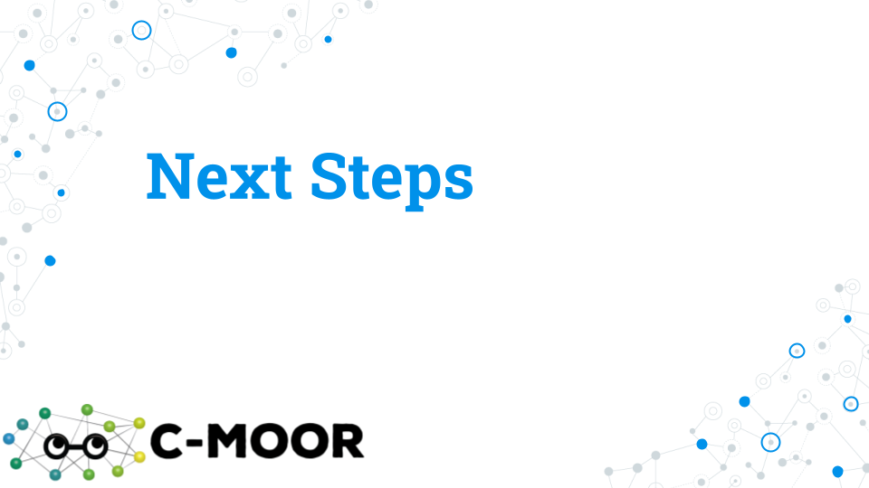
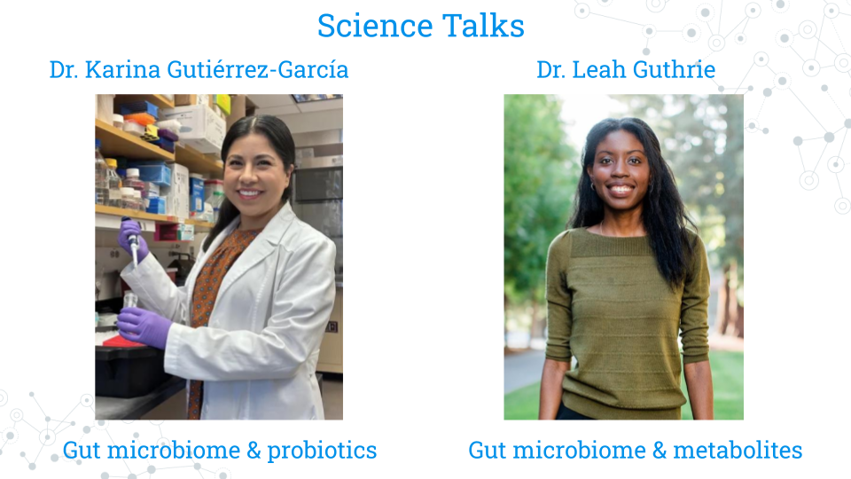

 
# (PART\*) Community analysis and feedback {-}
# Community analysis and feedback

<!-- Set up code -->

## Lecture - Scientific Posters

*Estimated time: ---*

<!-- change fig.align quotes from single to double: DID NOT WORK-->

<!-- change fig.align quotes from single to double and remove fig alt-->

[Scientific Posters](https://docs.google.com/presentation/d/1-orSi8DpN22hMt9-6p_rHZnte1YXXLe-a132HDSyd0U/edit?usp=sharing)

## Activity - Scientific Posters

### Activity

*Estimated time: ---*

#### Instructions

1. Review **[Presentations Guidelines for Posters](https://ur.umbc.edu/urcad/resources/posters-guidelines)**

2. Skim three posters from among the following (must be Biology if from UMBC Posters)

- **[Look at This! Category on the Academy Discussion Forum](https://help.c-moor.org/c/look-at-this/8)**

- **[UMBC Biology Posters](https://ur.umbc.edu/poster-presentation-examples)**

- **[The example PacBio Poster](https://www.pacb.com/wp-content/uploads/PAG-Portik.pdf)**

3. Pick one poster and address the following points.

- **Notice** – What about this poster most interests you?

- **Wonder** – Two or three questions you would ask the authors.

- **Support** – Two or three suggestions on how the poster could be improved.

4. Post your answers by replying to the “Project Work: Scientific Posters” topic in the Discussion Forum

### Grading Criteria

- <mark style="background-color: yellow">Submit URL to your reply on Canvas</mark>.

### Footnotes

**Contributions and Affiliations**

- Valeriya Gaysinskaya, Johns Hopkins University
- Frederick Tan, Johns Hopkins University

Last Revised: February 2025

## Activity - Share Your Poster

### Introduction

It's almost time!  Prepare for your final presentation by thinking about how to describe the great work that you've done this semester in both written and oral form.  Assume that your audience has a basic scientific background but does not know a lot about your particular field.  Provide enough context to give your listener a reason to care about your project and each of the results you will describe.  You have five minutes to get your story across so have a plan and practice.

#### Activity 1 – Share Your Poster

*Estimated time: 20 min*

#### Instructions

1. Download your poster as a .png file
- [https://drive.google.com/drive/folders/1y_GCJl7VIYTS_5y7057u2s58ZCdm_PxM](https://drive.google.com/drive/folders/1y_GCJl7VIYTS_5y7057u2s58ZCdm_PxM)

2. (One person on behalf of the group) Create a New Topic on the Discussion Forum with the title of your poster as the topic title and your .png file as the contents in either the

a. Look at This! category if every member of your group is ok sharing your work publicly
[https://help.c-moor.org/c/look-at-this/8](https://help.c-moor.org/c/look-at-this/8)

b. JHU 2025 Spring category if you need to keep your work private
https://help.c-moor.org/c/jhu-2025-spring/46

3. (Each person in the group) Reply to your topic using your own words with the following two bolded sections using the following template

|  |
|:--|
|**What I Did**|
|<Briefly describe what you did including what you found most interesting>|
|**How You Can Help**|
|<Briefly describe how others could continue this analysis especially what you would do next if you were to continue this project>|
 

#### Questions

| 1. Provide URL of your Discussion Forum post |
|:--|
||
 

### Activity 2 – Present Your Poster

*Estimated time: 40 min*

#### Instructions

1. Create a plan for a 5 min presentation taking into consideration

a. Who will speak when

b. What each person will cover

2. Practice your presentation

a. In your group

b. To the class

#### Questions

| Create a bullet point outline of who will speak what when: |
|:--|
|Overview (question, background, hypothesis)|
|Approach (dataset, general methods) |
| Results (detailed methods, notable results)|
|Conclusions (summary, next steps)|
 

### Grading Criteria

- Download as Microsoft Word (.docx) and upload on Canvas

### Footnotes

**Resources**

- [Google Doc]

**Contributions and Affiliations**

- Valeriya Gaysinskaya, Johns Hopkins University
- Frederick Tan, Johns Hopkins University

Last Revised: April 2025

# Professional Development

Now that you've finished your C-MOOR project, how do you close out your research experience or take it further? In this section we'll explore how to publicize and use your experience to help build your professional career.

## Lecture - Next Steps

*Estimated time: ---*

[Slides: Next Steps](https://docs.google.com/presentation/d/1PMvZ19kSTK2ghdgLNFRS_t5p8R_GKFNbExPRxMsE1Ns/edit?usp=sharing)

## Activity - Next Steps

### Introduction

Congratulations on making it to the end of Microbial Mysteries!  Take a moment and reflect on all that you've accomplished during this semester, especially those of you who reported in the Welcome Poll "No experience" with Microbiology, Galaxy, and Scientific Research.  While the "Grad Student Motivation Level" PHD Comics spans years, it likely reflects the ups and downs as you developed and explored your hypothesis, including the thrill of presenting your work to people in our mini-symposium.  The feedback has been great with faculty impressed at what you’ve accomplished, the depth that you understand your projects, and even one scientist who does metagenomics research reporting that they learned a new trick or two!  

We’ll wrap up today with several next steps including completing feedback to improve the next offering of this course , researching opportunities to do more science, exploring communities where scientists openly share insights, and optionally sharing more work.

### Activity 1 – Complete Feedback

*Estimated time: 15 min*

#### Instructions

Help us improve this course as we work to grow enrollment to accommodate 32 to 64 students, incorporate graduate TAs and undergraduate course assistants and tutors,  and promote more computational training and research opportunities throughout departmental courses
https://forms.gle/XkqiMERHc2PETmy4A

### Activity 2 – Research Opportunities

|1. Find one LAB at YOUR INSTITUTION  that you would work in and explain why.|
|:---|
| Your text here:|
 

|2. REU – Which NSF Research Experiences for Undergraduates program would you attend and why?|
|:---|
| a. Overview – [https://www.nsf.gov/funding/initiatives/reu/students](https://www.nsf.gov/funding/initiatives/reu/students)|
| b. Search – [https://www.nsf.gov/funding/initiatives/reu/search](https://www.nsf.gov/funding/initiatives/reu/search) 
- Consider filtering by Research Area (e.g. Biology)|
| Your text here: |
 

### Activity 3 – Explore Communities

*Estimated time: 15 min*

#### Instructions

Spend a little bit of time browsing communities that discuss genomics, data analysis, and more.  Paste the URLs for a couple of posts that you find interesting with a brief comment.

#### Questions

1. Specialized Communities

a. SEQanswers: the next-generation sequencing community 

- [https://www.seqanswers.com](https://www.seqanswers.com)

b. Biostars: bioinformatics explained 

- [https://www.biostars.org](https://www.biostars.org)

|Post URL of interest for Specialized Communities and your comments here:|
|:---|
| |
 

2. General Communities

a. Reddit: The heart of the internet

- [https://www.reddit.com/r/metagenomics](https://www.reddit.com/r/metagenomics)

b. Twitter/X: It’s what’s happening

- [https://x.com/search?q=%23metagenomics](https://x.com/search?q=%23metagenomics)

c. Bluesky: Social media as it should be

- [https://bsky.app/search?q=metagenomics](https://bsky.app/search?q=metagenomics)

|Post URL of interest for General Communities and your comments here:|
|:---|
| |
 

### (Optional) Activity 4 – Share Work

*Estimated time: 15 min*

#### Instructions

1. Upload photos – Especially photo of your group standing in front of your poster

- [https://drive.google.com/drive/folders/1y_GCJl7VIYTS_5y7057u2s58ZCdm_PxM](https://drive.google.com/drive/folders/1y_GCJl7VIYTS_5y7057u2s58ZCdm_PxM)

2. Publicly share poster – If every member of your group is ok sharing your work publicly

- [https://help.c-moor.org/c/look-at-this/8](https://help.c-moor.org/c/look-at-this/8)

### Grading Criteria

- Download as Microsoft Word (.docx) and upload on Canvas

### Footnotes

**Resources**

- Google Doc

**Contributions and Affiliations**

- Valeriya Gaysinskaya, Johns Hopkins University
- Frederick Tan, Johns Hopkins University

## Science Talks

Science Talks feature a guest lecturer to showcase their research work, share their scientific journety and engage in Q and A with the students. It is a one of a kind opportunity for students to engage with a scientific scholar and/or expert from across departments, fields, and career stages and explore, broaden or narrow students' scientific interests.

 

The two invited speakers for the Microbial Mysteries CURE Spring 2025 at the JHU were:

1. Dr. Karina Gutiérrez-García
2. Dr. Leah Guthrie

For each speaker, students were asked to prepare by completing the Science Talks Activities.

### Science Talks - Activity 1

*Estimated time: 50 min*

1. Read/Browse the following information about **Dr. Karina Gutiérrez-García**

a. Postdoc Spotlight [carnegiescience.edu/news/postdoc-spotlight-karina-gutierrez-garcia](carnegiescience.edu/news/postdoc-spotlight-karina-gutierrez-garcia)

b. “Home sweet home” perspective on study of fruit fly gut microbiome [pubmed.gov/39637006](pubmed.gov/39637006)

c. Abstract for “A conserved bacterial genetic basis for commensal-host specificity” [pubmed.gov/39636981](pubmed.gov/39636981)

d. Abstract for “Gut microbiomes of cycad-feeding insects tolerant to β-methylamino-L-alanine (BMAA) are rich in siderophore biosynthesis [pubmed.gov/37993724](pubmed.gov/37993724)

2. Post three questions to the speaker in the Discussion Forum at [https://help.c-moor.org/t/469](https://help.c-moor.org/t/469).

1. Science – What scientific question do you have about Speaker’s research, ranging from basic background questions to possible next steps?
2. Method – What methods would you like the Speaker insight on, whether computational, genomics, or other exciting technologies?
3. Career – What advice would you ask the Speaker for regarding how to get started, finding a mentor, etc.?

### Science Talks - Activity 2

*Estimated time: 50 min*

1. Read/Browse the following information about **Dr. Leah Guthrie**

a. Faculty focus [qb3.berkeley.edu/news/faculty-focus-leah-guthrie](qb3.berkeley.edu/news/faculty-focus-leah-guthrie)

b. Abstract for “Impact of a 7-day homogeneous diet on interpersonal variation in human gut microbiomes and metabolomes” 
[pubmed.gov/35643079](pubmed.gov/35643079)

c. Abstract for “Human microbiome signatures of differential colorectal cancer drug metabolism” [pubmed.gov/29104759](pubmed.gov/29104759)

2. Post three questions to the speaker in the Discussion Forum at [https://help.c-moor.org/t/469](https://help.c-moor.org/t/498).

1. Science – What scientific question do you have about Speaker’s research, ranging from basic background questions to possible next steps?
2. Method – What methods would you like the Speaker insight on, whether computational, genomics, or other exciting technologies?
3. Career – What advice would you ask the Speaker for regarding how to get started, finding a mentor, etc.?

## Create your CV

*Estimated time: 10 min*

Everyone who completes a C-MOOR project can add their experience to their resume or CV! We advise you and your students to do this as soon as possible after the end of class while your research project is still on your mind.

#### Resume or CV?

You may hear the terms resume and CV being used interchangeably. While both are drawn from the same information, they vary in brevity and focus.

A **resume** is a one-page (sometimes two-page) document of your experiences generally used for jobs outside of academia and research labs. It's not uncommon for people to have more than one resume, as it's best to tailor every resume to each specific role you're applying to.

A **Curriculum Vitae (CV)** is an extensive document that can take as many pages as needed to list the entirety of your research and academic experience. It often includes sections that aren't found in non-academic fields such as publications, conferences, and published papers. 

Most positions will detail which they require from applicants and most colleges and universities will be able to help you build either at your library or career center. We suggest that current students and recent graduates interested add their C-MOOR research experience to either their classwork or projects section. Remember to acknowledge the contributions of your team members if applicable; this does not count against you in your applications! Here are some examples of how you might word your experiences; notice how they're similar to an abstract in just one or two sentences:

- **An RNA-seq project:** Along with a partner, examined differential expression data of the *period (per)* gene along the *Drosophila melanogaster* midgut from a published dataset (Marianes & Spradling 2013) using DESeq2 and ClusterProfiler. We discovered an elevated expression of per in the anterior region of the midgut where the primary digestion and absorption of carbohydrates occur. Our results were presented as a research poster at the 2025 Kuntz Research Day symposium and have implications for using Drosophila as a model for the connection between the circadian rhythm and metabolic disorders.

- **A 16S project:** My group and I profiled the abundance of Archean ASVs in the gut microbiome from a published 16S study comparing the gut microbiota of people before, during, and after a standardized diet (Guthrie et al. 2022). As a part of this study, we created a PCoA and performed an alpha diversity analysis in phyloseq. Archean community members are often overlooked in microbiome studies; we found differential abundance in *Methanobacteria* between male and female participants regardless of diet and hypothesize this may be due to consumption of fiber reported by male subjects pre- and post-diet.

- **A WGS project**: Public data (SRA#######) from Robinson et al. (2021) was analyzed in Galaxy using Trimmomatic, Megahit, and Krona to determine the viral abundance in samples from tap water from various North American Lakes and make comparisons to lake depth. Viral abundance was correlated with geographic distance between samples; future studies could examine if this pattern persists in samples sourced from Europe and Oceana. 

Your blurb is a strong blurb when:

- [ ] &nbsp; You credit the source of your data (Citation, SRA #, Project #)
- [ ] &nbsp; You describe why your research project matters
- [ ] &nbsp; You list some of the computational platforms or software you used

**Q: Will people think I am an expert in genomics and bioinformatics if I put my project on my resume/CV? I don't want to look like a phony.**

A: As a current student or new graduate, you are not expected to have mastery over any scientific domain. What you are trying to show is you have taken an idea and brought it to completion, your ability to learn new concepts and skills, and your previous exposure to research. You can explain more about your role in the project in an interview.

**Q: Can I list things like R or Galaxy in my skills section?**

A: You can, however we suggest being explicit in your experience and add the level at which you feel comfortable with each respective platform. Are you R (Beginner) or R (Proficient)? Can you teach someone else how to do your project? Can you perform your project with novel data? How good are you at troubleshooting? This answer may seem contrary to the previous one, but remember that other people who are listing these platforms in their skills section includes computer/data scientists (majors) and bioinformaticians (majors), so people may assume mastery. Think about it the same way you would a foreign language. Spanish (Beginner) describes a different level of skill than 'just' Spanish. 

# C-MOOR Scholars

## C-MOOR Scholars

C-MOOR Scholars are research clubs that function as an extension of the C-MOOR curriculum. You can explore techniques and concepts from modules you've yet to take to learn about different approaches we can use to explore different questions through genomics, connect with other scholars and mentors, and experience the climate of a research lab. 

Fill out our [C-MOOR Scholars Interest Form](https://docs.google.com/forms/d/1GJDpfG28k2utCVVcRXQraE-1coLS_GCX83irUyio9KE/viewform?edit_requested=true) if interested, and meet some [C-MOOR Scholars at Clovis Community College](https://www.cloviscollege.edu/alumni-and-community/c-moor/c-moor-scholars.html)!

**What C-MOOR Scholars is**:

  - A place to grow your skills
  - A place to network
  - A place to connect science with the greater community

**What C-MOOR Scholars is not**:

  - A commitment to pursuing research as a career
  - A graded class where we score work
  - A drop-in drop-out popular science club
  
Less formal than a class, more formal than just a gathering of like-minded minds, C-MOOR Scholars provides structure for your growth as a scientist. We are actively looking to recruit new scholars for chapters at our established sites (CCC, JHU, & NDMU); speak with your instructor for more information or reach out to us at the [C-MOOR Academy Discussion Forum](help.c-moor.org) to hear about any remote opportunities we have.

### C-MOOR Scholars links

Share your interests via C-MOOR Scholars Interest Form and learn how C-MOOR community can support you.

- [https://docs.google.com/forms/d/1GJDpfG28k2utCVVcRXQraE-1coLS_GCX83irUyio9KE/edit](https://docs.google.com/forms/d/1GJDpfG28k2utCVVcRXQraE-1coLS_GCX83irUyio9KE/edit)

Meet the C-MOOR Scholars and learn how you can support them

- [https://www.cloviscollege.edu/alumni-and-community/c-moor/c-moor-scholars.html](https://www.cloviscollege.edu/alumni-and-community/c-moor/c-moor-scholars.html)

## Pursue further research

Perhaps you're interested in pursuing research beyond what C-MOOR currently provides. Maybe you're more interested in wet lab work, or a specific model organism. We encourage you to try all sorts of different opportunities even if you feel totally comfortable working with C-MOOR so you can better understand what kind of roles suit you best. This section serves as a guide for some common jumping off points to find outside research opportunities.

### Research opportunities at your institution

Many colleges and universities have research programs for their students or resources available to connect you to some. You can ask your instructor, adviser, or library for more information. Some popular programs include:

- **Undergraduate Research Opportunity Programs (UROP):** Which often provide a database or pipeline of research opportunities for students at the univeristy or from surrounding areas. 

- **Research experiences for undergraduates (REU):** Similar to UROP, but generally open for a wider audience of students from outside the community. See the [NSF REU website](https://www.nsf.gov/funding/initiatives/reu) for more information.

Opportunities come and go and often follow the academic-year in terms of availability. If you can't find something immediately, keep trying!

### Find a research lab to join

You can choose to pursue additional research opportunities in what we consider the more traditional way: by reaching out to a professor or research scientist whose work you are interested in and asking if they might be willing to have you in their lab. As these opportunities are at the discretion of the lab leader they will vary widely in their scope, duration, and ability to provide financial support.

An email to a potential research lab should contain:

- [ ] &nbsp;An introduction about yourself (name, class year, institution, major)
- [ ] &nbsp;1-2 sentences about your previous experience in research
- [ ] &nbsp;1-2 sentences about why you're interested in their lab specifically
- [ ] &nbsp;A polite, open ended request to work with them

> Dear Professor Penguin,

>My name is Student, and I am a junior at My University majoring in biology (or other). I read your chapter on the genetics yellow-eyed penguins in Penguins: Natural history and conservation, and then checked out your profile on the University website. My interests are broadly defined in environmental toxicology and I am interested in the work you are doing using eDNA and studies on the effects of plastic on developing penguin transcriptomes.

>I previously completed a project as a part of an RNA-seq miniCURE and have some exposure to working with DESeq2, though I still have much to learn. My group and I profiled the gene expression of the genes XYZ in the Drosophila midugt and I presented our poster at our university's research day poster session.

>Thank you for your time and consideration in reading my email. Please let me know if you are currently available to mentor an undergraduate in your lab and if you would be willing to have me as a potential student. I hope to hear from you soon!

Don't be surprised if it takes the researcher a while to get back to you or if they respond curtly. They likely get many requests and are very busy. Continue to reach out to labs and apply to programs; it is difficult to know when opportunities are available as funding fluctuates.

## BioDIGS

This section is primarily geared toward instructors as students will be able to get access to the BioDIGS data through their local C-MOOR Scholars chapter.

**What is BioDIGS?**: [BioDIGS](biodigs.org) is a project from the Genomic Data Science Community Network (GDSCN), which aims to characterize the microbiome of soil throughout sites in the US while connecting scientists to research. 

**What makes BioDIGS different?:** Soil is hypothesized to be the most diverse system on our planet, and BioDIGS is gathering sequence data and matching environmental data to elucidate the connection of soil microbes to abiotic variables and human health. Students at participating sites can take the entire project from soil sampling all the way through computational analysis. Curricula and more information on how to get a soil sampling kit are available on the BioDIGS website.

# Online Community

The genomic data science community is a remarkably open community that continually strives to increase opportunitites and broaden access to the scientific enterprise (e.g. [GDSCN 2022](https://pubmed.gov/35858750){target="_blank"}).
There are many opportunities to interact online with scientists that share a common research question, career stage, or even favorite tool!
Below is a sampling of some discussion forums that you may find useful:

- [help.c-moor.org](https://help.c-moor.org){target="_blank"} for help with and example miniCUREs
- [help.galaxyproject.org](https://help.galaxyproject.org){target="_blank"} for all things Galaxy
- [support.bioconductor.org](https://support.bioconductor.org){target="_blank"} for all things R/Bioconductor
- [help.anvilproject.org](https://help.anvilproject.org){target="_blank"} for interactions with the GDSCN BioDIGS consortium [https://biodigs.org/#home](https://biodigs.org/#home)

