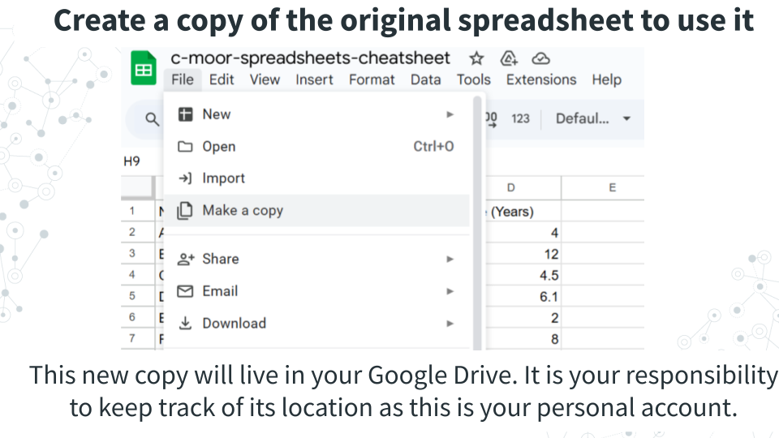
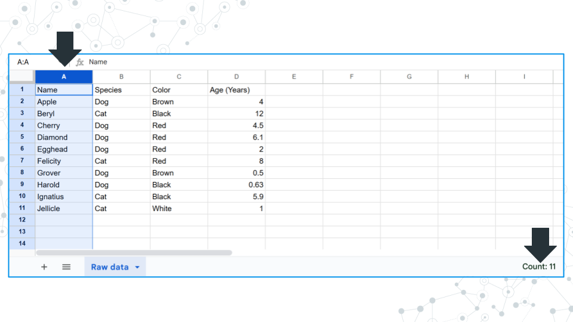
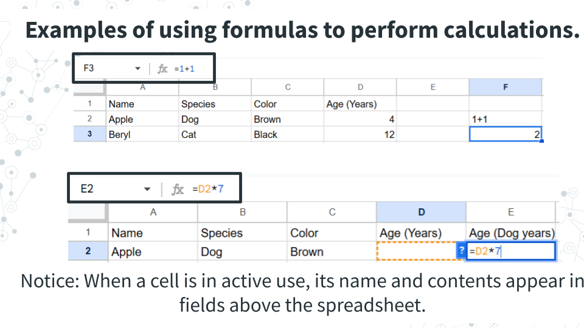
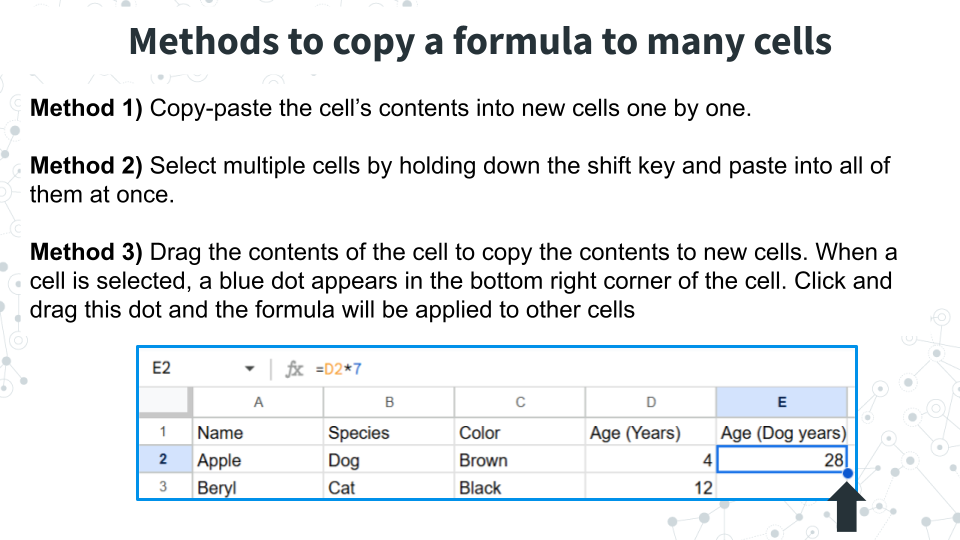
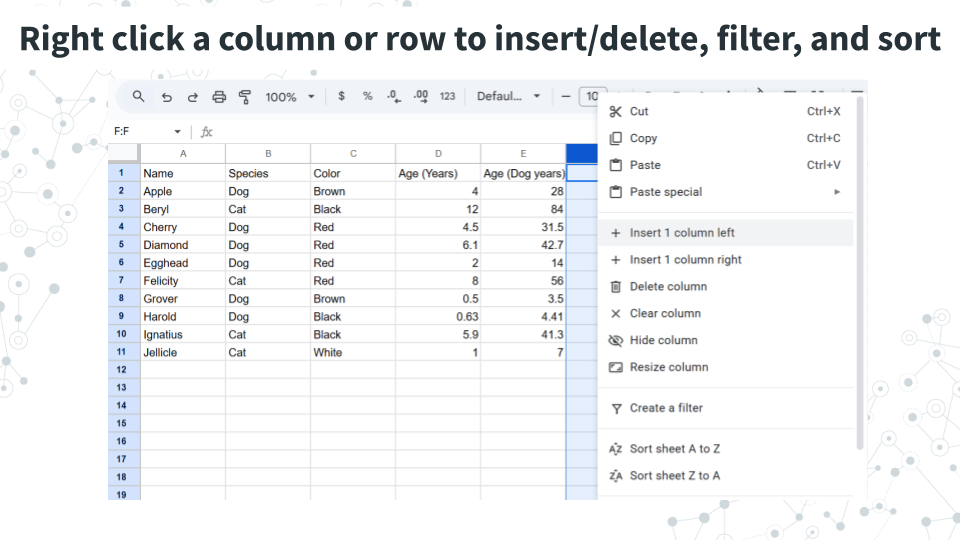
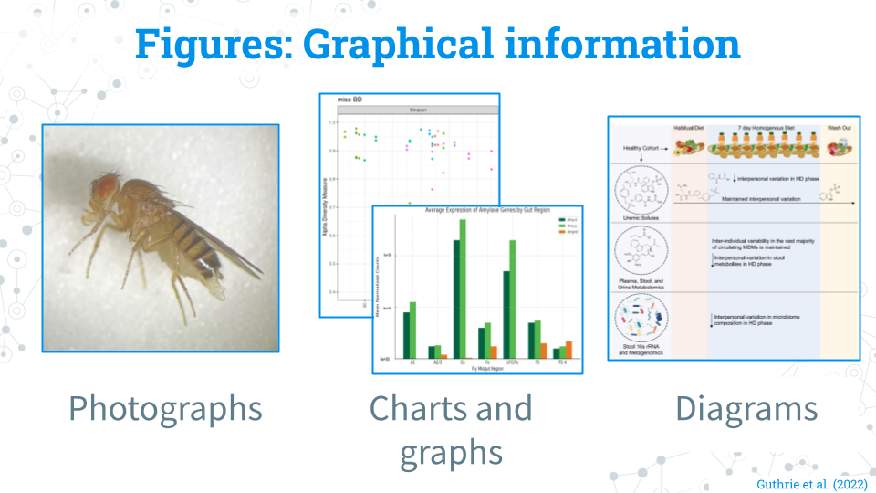
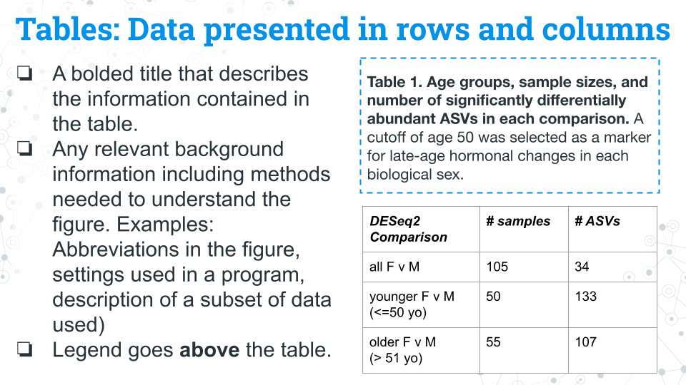
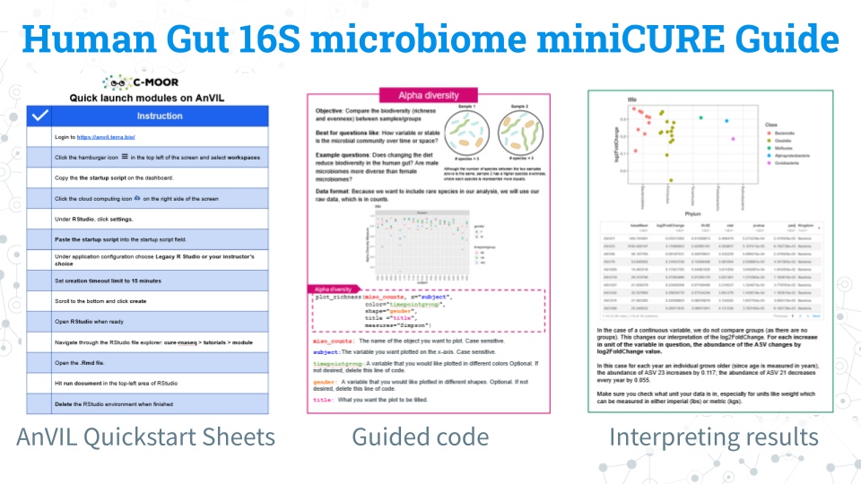

# (PART\*) Resources {-}

# Spreadsheets 101

**Spreadsheets** are tables that organize data using rows and columns. Spreadsheets are used in nearly every field of study and in personal life. The two most popular spreadsheet programs are Google Sheets and Microsoft Excel. While they can do approximately the same things, the exact steps to perform analyses are slightly different. <mark>To keep things standardized between students we ask all students to use Google Sheets, which is also free for users with a Gmail account</mark>.

This section will cover some of the basic functions of Google Sheets.

:::{.attention_box_lightbulb}
:::{.attention_header_box_lightbulb}
:::{.attention_title}
#### **Right clicking?**
:::
:::
::: {.attention_content}
A traditional mouse has a left button, a right button, and sometimes a center button. Typically, you click with the left button. Right clicking refers to clicking with the right button.

Modern laptops and tablets have translated this feature in different ways. If you’re not using a mouse or find that clicking with the right or right-bottom corner of the trackpad doesn’t work, try the following:

1. Right click by holding Ctrl and left-clicking
1. Tapping with two fingers as opposed to one
:::
:::

### Getting a copy of the spreadsheet

Spreadsheets are featured in some of our C-MOOR curricula. We keep an original copy of the spreadsheet that can't be edited by students and ask users to create a new copy to do their calculations in.

You will need to make a copy of the original spreadsheet in order to interact with it. To do so, in the top left corner of the window, under the name of the spreadsheet and to the right of the spreadsheet icon, click **File > Make a copy**. This new copy is yours to keep track of in your Google Drive.

### Basic spreadsheet terms

**Columns**: Refers to the vertical groupings of data types and called by a letter (ex. Column A, B, C, and D. 

**Rows**: Refers to the horizontal grouping of data types and called by a number (ex. Row 1, 2, 3…). In this example data, each row refers to a pet.

**Cells**: Refer to the intersection between a given row and column and can be called by a combination of their column and row. Example: B2 refers to the intersection of column B, row 2 (which contains “Dog”).

**Header**: Used to refer to the first row, which contains metadata or describes the data in each column. 

### Summary statistics by row or column

**Clicking on a column or row gives you the count of how many filled in cells there are in the bottom right area of the window. Notice how there are 11 cells filled and reported but only 10 of them contain real data.** Cell A1 contains “Name”, which is a label for what kind of data is stored, but not data itself. Keep this in mind when answering questions about count.

If numerical data is detected, you can click on the field in the bottom right corner and toggle it to **display the sum, average, minimum, maximum, count value, and count value only including numbers**.

### Adding data to cells

To add data to a cell, click on the cell and enter your data. Confirm the entry with the “Enter” or “Return” key on your keyboard or by clicking or moving to another cell with the arrow keys. 

**Notice: Above the columns there is a field where you can see what is in a selected cell.**

To add calculations to a cell, use the = sign. Spreadsheet software will treat any cell with an = sign as a calculation, and it will treat any cell without an = sign as text. To do this, compare what happens when you have cells with the following.

- 1+1
- = 1+1

1+1 will remain at 1+1, where as = 1+1 will cause the cell to calculate 2. We can see the original calculation we put into the cell above the columns. Calculations only work for numerical values. Cells with invalid calculations will cause a pop-up to warn you the cell is invalid.

To add calculations based on cell values, the formula must contain the specific cell. We can manually type out the combination of column and row that refers to a cell (ex. D2, or:

1. Type = into a cell
1. Click on the cell you want to use in a calculation
1. Complete the calculation formula.
 
**Notice: The cell used has colored borders matching the formula.** You can interact with these borders to select different cells and find what is currently selected.

### Applying a calculation to many cells

To use the calculation multiple times, we can do the following, all of which will copy the formula and carry down the selected cells so you don’t have to reselect the cells used for new rows and columns. Try the following below to see what we mean.

**Method 1)** Copy-paste the cell’s contents into new cells one by one. You can copy the cell with Ctrl+C or right clicking the cell and selecting copy. You can paste the calculation formula into new cells with Ctrl+V or right clicking the new cell and selecting paste.

**Method 2)** Paste into multiple cells at one time. If you have a calculation that needs to be applied many times, it can be inconvenient to paste a copied formula over and over. In this case, select multiple cells by holding down the shift key and paste into all of them at once.

**Method 3)** Drag the contents of the cell to copy the contents to new cells. When a cell is selected, a blue dot appears in the bottom right corner of the cell. Click and drag this dot and the formula will be applied to other cells

### Manipulating the spreadsheet

Right clicking a column or row brings up a menu with options for adding or deleting columns/rows, filtering data, or sorting the spreadsheet.

**Add or delete columns/rows**: Insert or delete a column or row.

**Filtering data**: Filter data so that only rows that have a specific value are shown. In the above example, you could filter by species and retain only rows (pets) that are dogs. 

**Sort the spreadsheet**: Sort the spreadsheet based on the values in the selected column (does not work for rows): alphabetically (A to Z), reverse alphabetically Z to A), lowest to highest (A to Z), highest to lowest (Z to A). 

### Useful formulas in Google Sheets

|Calculation|Formula|
|----|--------------|
|Sum|=sum(CELLS)| 
|Average (Mean)|=average(CELLS)|
|Median|=median(CELLS)|
|Maximum|=max(CELLS)|
|Minimum|=min(CELLS)|
|Count cells that meet a certain condition|= COUNTIF(CELLS, "condition, where if true, the cell will be counted")|
|Variance within a sample|=var.s(CELLS)|

:::{.attention_box_lightbulb}
:::{.attention_header_box_lightbulb}
:::{.attention_title}
#### **On variance**
:::
:::
::: {.attention_content}
Variance is a measure of how spread out or consistent a dataset is, and is similar in concept to the standard deviation of a dataset (although there are differences in how they are calculated). For both variance and standard deviation there are alternate formulas for datasets that comprise a sample - var.s (which is used above), and for datasets that comprise entire populations (var.p). We use the population version when our dataset encompasses the entire population that we are interested in. Make sure you select the right formula for the right question! The majority of times, var.s will be more appropriate. If you're not sure what to use, ask your instructor.
:::
:::

# Figure and tables guide

Figures and tables are found in all forms of scientific communication: posters, papers, and presentations. The information on this page is specific to posters and papers, although a good presentation will build off the materials here. 

### Figures

**What counts as a figure:** Pretty much everything that isn't a table that contains graphical information: Photographs, charts/graphs, and diagrams (digital and traditional) all count as figures! If it's an image, it probably belongs as a figure!

**Cleaning a figure:** Prepare the figure in a program like Google Slides or Powerpoint that will allow you to change the text size and fonts; you can do this with a creative use of cropping and text boxes with a solid white background. Add notes and adjustments where they would make the figure more easily understandable (ex. ordering samples by group and labeling their groups). The most important thing is that your figure is at a high enough quality and resolution that the pictures and text are not blurry!

**Figure legends**: Figure legends (also interchangably called figure captions) go underneath their figures. Figure legends should include the following (feel free to ask your peers or instructor to review your legends):
- A comprehensive title in bold that describes what the figure is about or the methods used to make the figure
- Text describing the main takeaway from the figure
- Text describing the methods used to generate the figure if needed
- Text detailing any other background information or methodology needed to understand the figure (ex. abbreviations, settings of a program, description of subsetted data)
- The legend/caption goes below the figure

**Multi-panel figures:** You may encounter or want to make a figure with multiple panels. These figures are a collection of figures that are denoted alphabetically (ex. A, B, C, D...etc.). Multi-panel figures often are used to save space or group related figures together. In most published work you will see only figures in panels; your instructor may allow or encourage you to use tables in panels for your project.

- Each panel is denoted by a different letter.
- The title is comprehensive of both panels.
- Bolded letters draw the reader to the part of the legend specific to each panel.
- The standard information for the legend is included for each panel.

### Tables

Tables contain information organized into rows and columns. Common examples of information that gets put in tables include: subject metadata (age, ethnicity, etc.) and sample sizes (how many samples of each condition) throughout the experiment. Tables generally stand alone and are not included in published multi-panel figures, though your instructor may allow or encourage you to do so for your project.

**Table legends**: 
- A title that describes the information contained in the table
- Any relevant background information including methods needed to understand the table. Examples: Abbreviations in the figure, settings used in a program, description of a subset of data used) 
- Legend/caption goes above the table.

# 16S miniCURE Guide

We have a [comprehensive guide for this miniCURE](https://docs.google.com/presentation/d/1uipJ2uS2g8svKtWX-mN3MGvWYLWL9C0Pmv2nK6FjbCo/edit?usp=sharing)!

This guide is a complete packet that contains an overview of the learning objectives for ecah module, instructions for accessing modules on AnVIL, highlights of content, guided code blocks, and an overview of each dataset we have available for research projects!

Download the PDF for a digital reference and print out selected sheets for use in the classroom!

### Footnotes

**Contributions and Affiliations**

- Sayumi York, Notre Dame of Maryland University

Last Revised: August 2025
